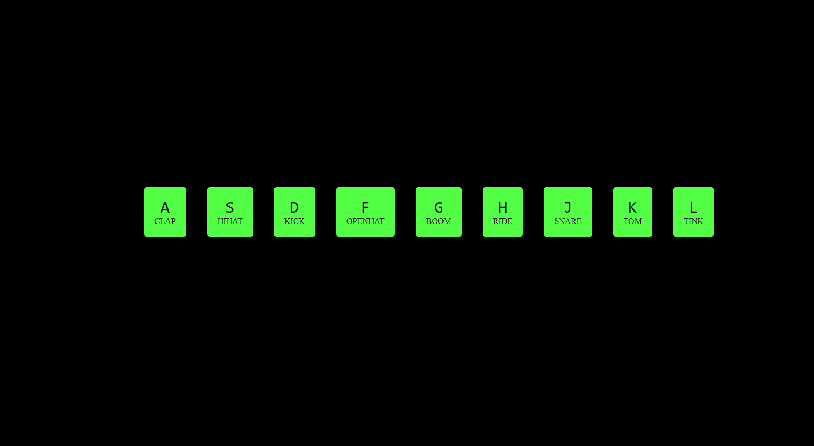

## Table of contents

- [01-Drumkit](#drumkit)
- [02-Css/JSClock](#cssjsclock)
- [03-CSS Variable Changing with JS](#css-variable-changing-with-js)
- [04-Array Cardio Day -1](#array-cardio-day--1)
- [05-Flex Panel Image Gallery](#flex-panel-image-gallery)
- [06-Ajax Type Ahead](#ajax-type-ahead)
- [07-Array Cardio Day-2](#array-cardio-day-2)
- [08-Fun With HTML5 Canvas](#fun-with-html5-canvas)
- [09-Dev Tool Tricks](#dev-tool-tricks)
- [10-Check Multiple Checkbox](#check-multiple-checkbox)
- [11-HTML video Player](#html-video-player)
- [12-Key Sequence Detection](#key-sequence-detection)
- [13-Slide In on Scroll](#slide-in-on-scroll)
- [14-Object and Arrays - Reference VS Copy](#object-and-arrays---reference-vs-copy)
- [15-LocalStorage and Event Delegation](#localstorage-and-event-delegation)
- [16-CSS Text Shadow Mouse Move Effect](#css-text-shadow-mouse-move-effect)
- [17-Sorting Band Names without articles](#sorting-band-names-without-articles)
- [18-Tally String Times with Reduce](#tally-string-times-with-reduce)

## 01-Drumkit
A javascript Drumkit. When we hit the corresponding key on our keyboard its going to do two things. First of all it's going to play the sound that's associated with the key and second of all its going to do a short little animation where it pops the button a little bit bigger. And then also it will apply a distinct border and a subtle background color.

## 02-Css/JSClock
This is an analog clock built using css. It takes in the current time from javascript and its going to update the second's, minute's and hour's hands accordingly.

## 03-CSS Variable Changing with JS
Here css variables can be updated with javascript. In this small project I've got three variables : spacing, blur and base color. When one of the variables is changed it will reflect on the embedded picture.

## 04-Array Cardio Day -1
I have practiced fundamentals of javascript , array methods such as `array.filter()`, `array.map()`, `array.sort()`, `array.reduce()`.
## 05-Flex Panel Image Gallery
This is a flex gallery. It leans heavily upon css for flexbox and transitions. When a picture is clicked, the picture will expand and two other words will come from above and below at the same time.

## 06-Ajax Type Ahead
This project is based on **Type Ahead Feature**. If we give any letter or word in the input field it's going to show everything that matches the specific letter or word. if we type **Bo** it's going to show every single city and state that matches whatever have been typed along with the population.

## 07-Array Cardio Day-2
I have practiced fundamentals of javascript , array methods such as `array.some()`, `array.every()`, `array.find()`, `array.findIndex()`, `array.splice()`.

## 08- Fun With HTML5 Canvas
This is a canvas. If we click down and drag our mouse and let go it's going to draw somthing on the canvas. As we draw the stroke width will change as well as the color. 

## 09-Dev Tool Tricks
This a small project where we can learn about some dev tools and console tricks. We can learn things like clearing the console, styling in the console, showing custom warning, error, info, table, viewing DOM elements in the console. We can also count word, the timimg to fetch some data, grouping some info together, interpolating and assertion.

## Check Multiple Checkbox
This is a checkbox where if we click a checkbox and then hold down the **shift key** and click another one, all the checkbox's between the first one and the second one will be checked. this works top to bottom but also from bottom to top.

1. ## HTML video Player
1. ## Key Sequence Detection
1. ## Slide In on Scroll
1. ## Object and Arrays - Reference VS Copy
1. ## LocalStorage and Event Delegation
1. ## CSS Text Shadow Mouse Move Effect
1. ## Sorting Band Names without articles
1. ## Tally String Times with Reduce
